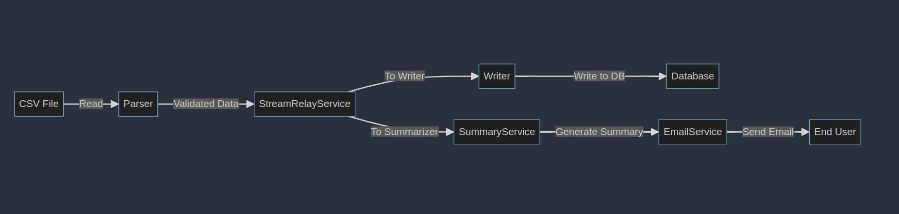

## Batch-Challenge

This document outlines the `batch-challenge` project, a Go application designed to parse CSV data, process transactions, and generate summaries.

## Overview

The application leverages concurrency to process large CSV files efficiently. It uses a modular design with distinct components handling parsing, writing, relaying streams, and summarizing data. T
he project is configured to run in a Docker environment, with PostgreSQL as the database backend.
# Quick Start Guide

This guide covers the essentials to get the Batch Processing Application up and running using Docker and Docker Compose.

## Prerequisites

- Go 1.21
- Docker
- Docker Compose

## Configuration

Set the following environment variables for the docker-compose file or use a `.env` file:

### Database variables
- Database credentials: `DB_HOST`, `DB_PORT`, `DB_USER`, `DB_PASS`, `DB_NAME`
- Data paths: `DATA_PATH`  
  this is the path to the directory containing the CSV file to be processed ("data.csv" as default)

### Mail server variables
default values are provided for all of these but `TARGET_MAIL` which is required

- `SMTP_HOST` 
- `SMTP_PORT` 
- `SMTP_USER` 
- `SMTP_PASS`

## Generating .csv

/gen/csv_gen.go generates a random csv file with 100000 rows using a simple format ready to use

## Build and Run

Execute the following script to build and start the application:

```bash
#!/bin/bash

# Build the Docker image
echo "Building Docker image..."
docker build -t demo_app:latest .

# Start the entire stack using Docker Compose
echo "Starting services with Docker Compose..."
docker-compose up -d

# Tail the application logs
echo "Tailing application logs..."
docker-compose logs -f app
```

Save this script as `start.sh`, make it executable with `chmod +x start.sh`, and run it with `./start.sh`.

This guide and script provide a streamlined process to build and run the application.
## Components

- `Parser`: Reads and validates CSV files according to a defined schema.
- `Writer`: Buffers and writes the parsed transactions to the database.
- `StreamRelayService`: Manages the propagation of data to the writer and summarizer.
- `SummaryService`: Aggregates transaction data and sends a summary report via email.
- `EmailService`: Configures and sends emails using provided SMTP settings.

This guide and script provide a streamlined process to build and run the application.
# Technical Architecture

## Component Descriptions

### Application (`Application`)
The central orchestrator that initializes all services and triggers the processing flow.

### Parser (`csv.Parser`)
Responsible for consuming CSV files. It validates and transforms the data based on a schema definition and sends the data to the `StreamRelayService`.

### StreamRelayService (`business.StreamRelayService`)
Acts as a conduit, taking in parsed data from the `Parser` and distributing it to both the `Writer` and `SummaryService` through a subscription system

### Writer (`business.Writer`)
Buffers the data and periodically flushes this buffer to the `Database`. It listens for data from the `StreamRelayService`.

### SummaryService (`business.SummaryService`)
Aggregates data for summary and sends an email report. It receives data from the `StreamRelayService` and utilizes the `EmailService` to dispatch emails.


### Database (`db.Repository`)
Persistently stores transaction records. It is accessed by the `Writer` to insert data records.

### EmailService (`business.EmailService`)
Configures and sends out emails. Used by the `SummaryService` to send out summary reports to users.

## Data Flow

1. **Initialization**: The `Application` starts and initializes all components, setting up their interconnections.
2. **Parsing**: The `Parser` reads the CSV file, validates, and transforms the data.
3. **Relaying**: The `StreamRelayService` receives parsed data and relays it to both the `Writer` and `SummaryService`.
4. **Writing**: The `Writer` buffers transactions and writes them to the `Database` at set intervals or buffer sizes.
5. **Summarizing**: Concurrently, the `SummaryService` aggregates data to create a summary report.
6. **Emailing**: Once the summary is ready, the `SummaryService` sends it via the `EmailService`.



